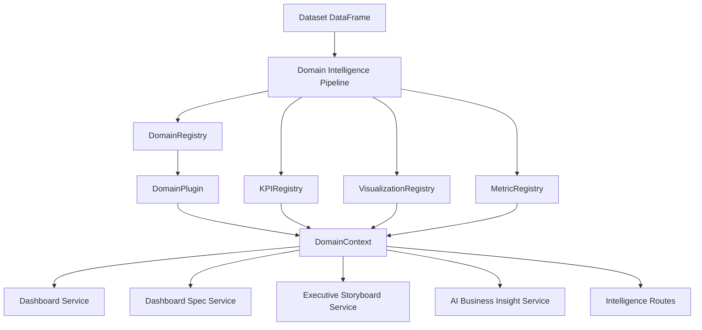

# Plugin-Based Analytics Architecture

## Overview
The platform now resolves domain behavior through registries and plugins, with `DomainContext` as the canonical context object.

## Diagram

## Registry Hierarchy
1. `DomainRegistry`: resolves plugin by domain/alias.
2. `KPIRegistry`: resolves KPI provider by domain.
3. `VisualizationRegistry`: resolves chart policy and ranking.
4. `MetricRegistry`: resolves metric semantics and strategies.

## Plugin Lifecycle
1. Domain detection determines candidate domain.
2. `DomainRegistry` resolves plugin.
3. Plugin provides templates, policies, recommendations, and suggested questions.
4. `KPIRegistry` and `VisualizationRegistry` enrich plugin output.
5. `DomainContext` is built and serialized to backward-compatible payloads.
