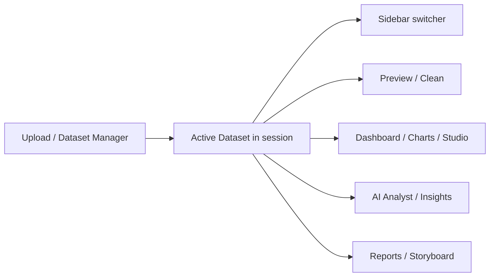

# UX Improvement Report — Active Dataset & KPI Quality

**Date:** 2026-07-12  
**Product:** Khaldun AI DataBot  
**Role:** Senior Product Manager / UX Architect review  
**Branch:** `develop`

## Principle

One dataset, many analyses (Power BI / Tableau). Upload once → Active Dataset in session → every page consumes it. Switch only in the sidebar.

---

## Issues found, fixes, status

| ID | Logical issue | Proposed fix | Status |
|----|---------------|--------------|--------|
| UX-01 | Upload once, but Dashboard / Charts / Reports / SQL / Storyboard / Location each showed “Select dataset” | Default `select_dataset()` to silent Active Dataset resolve; page pickers off | **Done** |
| UX-02 | No global dataset context | Sidebar **Active dataset** switcher + Upload/Manage shortcuts | **Done** |
| UX-03 | No “current dataset” chrome on pages | `render_active_dataset_banner()` at top of non-Home pages | **Done** |
| UX-04 | Upload aliased to Dataset Preview → every preview visit re-prompted upload | Dedicated `render_upload_page`; Preview uses Active Dataset; import behind expander | **Done** |
| UX-05 | Dataset Manager / Upload didn’t share one activation helper | `set_active_dataset()` used on upload + “Set as active” | **Done** |
| UX-06 | KPI cards rendered as custom HTML (risk of raw markup / inconsistent a11y) | `rich_kpi_grid()` + Streamlit `st.metric` with help tooltips | **Done** |
| UX-07 | AI Insights used `_html_card` HTML tiles | Replaced with `st.metric` + captions; remapped ambiguous labels | **Done** |
| UX-08 | Ambiguous labels (e.g. “Entities”) | Label map → “Distinct categories” / clearer names | **Done** (map + help text) |
| UX-09 | Duplicate upload on Preview & analysis paths | Preview upload collapsed; analysis pages no upload | **Done** |
| UX-10 | Home / recent datasets didn’t emphasize Active Dataset | Existing recent list still works; switcher is primary | **Partial** — Home CTA already points to Upload |
| UX-11 | Storyboard KPI HTML cards | Still uses `_storyboard_kpi_card_html` in places | **Open** — backlog |
| UX-12 | Executive storyboard / presentation HTML | Legacy presentation chrome | **Open** — backlog |
| UX-13 | Storage Manager file upload (artifacts) looks like dataset upload | Keep (different object type); caption already says artifacts | **Accepted** |
| UX-14 | 100+ stale test datasets in list pollute switcher | Filter deleted in list API earlier; consider hide `ds_test_*` / `ds_lifecycle_*` | **Open** — backlog |
| UX-15 | Data Cleaning still could feel like re-selecting | Now uses Active Dataset (no picker) | **Done** |
| UX-16 | KPI confidence / risk buried in HTML | Shown as captions + recommendation expander | **Done** |
| UX-17 | Users don’t know where to change dataset | Sidebar caption “Change in sidebar” on banner | **Done** |
| UX-18 | Backend `/datasets` 500 broke Manager empty state | Normalized metadata (prior fix) | **Done** (prior) |

---

## Workflow (target)

---

## Files touched

- `frontend/components/active_dataset.py` (new)
- `frontend/utils/local_helpers.py` — `select_dataset(show_picker=False)`
- `frontend/streamlit_app.py` — switcher, banner, Upload dispatch
- `frontend/app_pages/dataset_page.py` — Upload page + Preview without forced re-upload
- `frontend/app_pages/dataset_manager_page.py` — activate via helper
- `frontend/app_pages/dashboard_page.py` — KPI → `rich_kpi_grid`
- `frontend/app_pages/ai_insights_page.py` — metrics without HTML cards
- `frontend/design_system/cards.py` — Streamlit-native KPIs

---

## Remaining backlog (not blocking)

1. Migrate Storyboard / Executive presentation KPI HTML to `st.metric`
2. Hide synthetic test dataset IDs from the switcher in local/dev
3. Persist Active Dataset id across browser refresh (cookie / localStorage bridge)
4. Optional: collapse Admin nav by default when not on admin pages

---

## Validation notes

- Frontend-only for this UX pass (except prior `/datasets` normalize).
- Analysis pages call `select_dataset()` which now resolves Active Dataset without a selectbox.
- Refresh Streamlit after deploy; re-upload once if session was empty.
