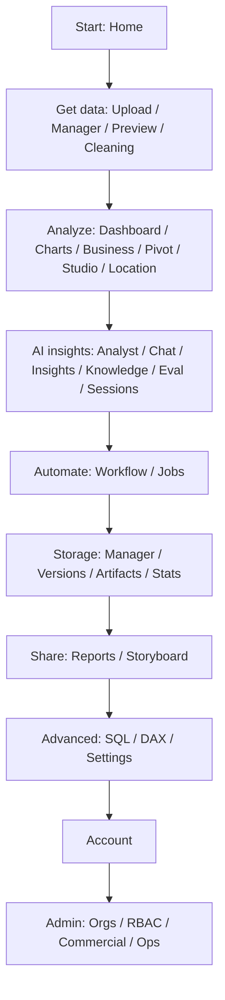
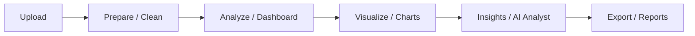

# Sprint 8.8 — UX/UI Polish Report

**Branch:** `develop`  
**Scope:** Frontend only (no backend/API/DB/AI architecture changes)  
**Date:** 2026-07-11

## 1. Before vs After (by area)

| Area | Before | After |
|------|--------|-------|
| Shared primitives | Ad-hoc `st.info` / `st.warning` / raw JSON | `frontend/components/ux_states.py`: empty/loading/error/success, status badges, section headers, workflow stepper |
| Navigation | 11 flat groups; storage/ops mixed into AI Workspace; API URL always visible | Power BI–style: Start → Get data → Analyze → AI insights → Automate → Storage → Share → Advanced → Account → Admin; API URL in **Connection** expander |
| Home | Hero + actions without clear path | Visible workflow stepper + Upload → Clean → Dashboard → AI Analyst → Reports; empty dataset CTA |
| Dataset flow | Sparse empty states; JSON-heavy manager status | Page intros, empty CTAs, status badges, overview metrics; raw JSON in expanders |
| Dashboard | Blank return on no dataset | Empty states + section headers; friendlier API error panel |
| AI Analyst / Insights | Flat chat bullets | Tabs: Executive Summary / Key Insights / Charts / Recommendations / Next Actions; Insights page section headers + next-action buttons |
| Workflow / Jobs | Raw JSON by default; weak status chrome | Stage timeline + badges; job progress badges; JSON collapsed |
| Evaluation / Knowledge | Basic forms | Scorecards + recommendation sections; search row + preview pane; empty states |
| Storage | Login warnings + blank lists | Empty states, status badges, stats summary headers |
| Global errors | Stack-oriented failures | Friendlier copy + Home/Retry; technical details in expander |

## 2. Why it helps (personas)

- **First-time user:** Sees Upload → Prepare → Analyze → Insights → Export instead of a flat admin/ops-heavy sidebar.
- **Analyst / Power BI user:** Nav groups match “get data → analyze → AI → share”; Connection is tucked away.
- **Excel user:** Empty states explain the next click (upload, clean, dashboard).
- **Manager:** AI Analyst output is sectioned for executive summary and recommendations without digging through JSON.

## 3. Screenshot placeholders

Streamlit was not reliably screenshot-automated in this sprint. Capture manually with the UI running:

1. Home — stepper + quick actions  
2. Sidebar — Get data / AI insights groups + collapsed Connection  
3. AI Analyst — structured answer tabs  
4. Workflow Monitor — stage timeline + badges  
5. Job Monitor — status badges on history  

Store under `documentation/12_pictorial_evidence/` when available.

## 4. Updated navigation map

## 5. Updated user flow

## 6. Accessibility notes

- Contrast relies on existing theme CSS variables (`--brand-primary`, `--text-muted`, etc.).
- Captions and `help=` on metrics provide secondary context.
- Primary actions use Streamlit buttons (keyboard-focusable).
- Status badges use color + text label (not color alone).
- Full WCAG audit and tokenized design system deferred to Sprint 8.9.

## 7. Responsive notes

- Workflow stepper wraps on narrow widths (`flex-wrap` + smaller step padding).
- Metric strips use `st.columns` / `use_container_width=True` on dataframes.
- Knowledge search uses a compact filter row; preview/list columns stack poorly on very small screens — debt for 8.9.

## 8. Remaining UX debt → Sprint 8.9 Product Design System

- Shared design tokens (spacing, type scale, radii) beyond ad-hoc CSS in `ux_states`
- Consistent page chrome for billing/admin/ops (only light empty states today)
- Chart/theme polish without changing analytics logic
- Keyboard/skip-link patterns and contrast audit
- Optional screenshot / visual regression harness
- Collapse Admin by default based on route (partially intended; refine)
- Unify legacy AI Chat vs AI Analyst IA further

**Do not start Sprint 8.9 in this sprint.** Recommend it as the next `develop` UX track item.
