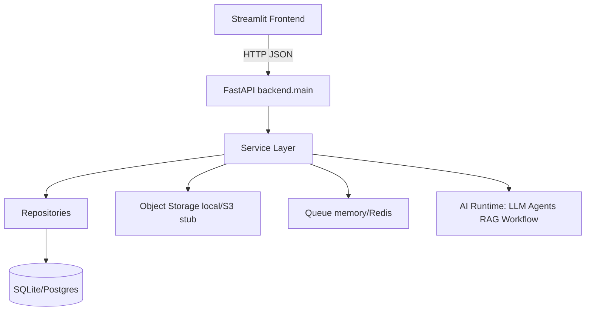

# 01 — Executive Summary

## What is Data Bot AI?

Data Bot AI (repository product name: **AI Analytics SaaS MVP**) is a **local-first analytics and AI analyst platform**. Users upload CSV/Excel datasets, explore KPIs and charts, run natural-language analysis through an AI Analyst runtime, manage knowledge/RAG, execute workflows and background jobs, and operate the platform with auth, RBAC, storage, monitoring, and commercial controls.

**Verified version:** `1.0.0` (`backend/core/config.py`, GitHub tag `v1.0.0`).

## Business problem solved

Organizations need a single place to:

1. Ingest tabular business data without a heavy BI stack
2. Produce dashboards, KPIs, and executive narratives quickly
3. Ask questions in natural language with governed AI workflows
4. Keep multi-tenant identity, storage, jobs, and observability in one product

## Target users

| Persona | Needs (verified by UI/API surface) |
|---------|-------------------------------------|
| Business analyst | Upload, clean, dashboard, charts, reports |
| Data / AI practitioner | AI Analyst, workflows, knowledge, evaluation |
| Platform admin | Orgs, RBAC, health, metrics, admin dashboard |
| Commercial operator | Plans, usage, API keys, invoices (no live payment gateway) |

## Major capabilities (verified)

- Dataset upload (CSV/XLSX), cleaning, profiling, analytics dashboards
- Charts, pivot, visual builder, SQL Lab, DAX Studio
- Reports (PDF/PPT), storyboard, geospatial/location insights
- AI Analyst (`/api/v1`), workflows, evaluation, knowledge ingestion
- RAG-related services and `/rag` route module (**mount in `main.py`: Not verified** — `rag_routes.py` exists; not listed in `create_app()` includes as of v1.0.0)
- Auth (JWT), organizations, workspaces, RBAC
- Jobs/queue/workers, object storage lifecycle
- Monitoring, metrics, release validation
- Billing plans/usage/API keys/admin (in-memory commercial stores for MVP)

## Architecture overview

## Technology stack (pinned)

| Layer | Technology | Pin evidence |
|-------|------------|--------------|
| API | FastAPI 0.115.6, Uvicorn 0.32.1 | `requirements.txt` |
| UI | Streamlit 1.40.2 | `requirements.txt` |
| Data | pandas 2.2.3, Plotly 6.8.0 | `requirements.txt` |
| ORM | SQLAlchemy 2.0.50, Alembic 1.14.0 | `requirements.txt` |
| Queue | redis 5.2.1 (optional) | `requirements.txt` |
| Export | reportlab, python-pptx, openpyxl, Pillow, kaleido, matplotlib | `requirements.txt` |
| Auth crypto | Custom JWT/HMAC + PBKDF2 (stdlib) | `backend/security/` |

## System lifecycle

1. **Develop** on `main`
2. **Test** with pytest (634 passed at v1.0.0 gate)
3. **Deploy** API (`uvicorn backend.main:app`) + Streamlit + optional worker
4. **Operate** via `/api/v1/live`, `/ready`, monitoring, release validation
5. **Maintain** hotfixes on `release/v1.0`

## Deployment model

- Single-node / Docker Compose (`docker/`)
- Local filesystem storage by default
- Optional PostgreSQL + Redis
- **Not verified / out of scope for 1.0:** Kubernetes manifests, live billing gateway, enterprise SSO

## Advantages

- End-to-end product surface (data → AI → ops → commercial)
- Local-first MVP with production hardening (Sprint 8.7)
- Large automated test suite
- Documented release gates and known limitations

## Limitations

See root `KNOWN_ISSUES.md` (KI-001…KI-008): no payment gateway, some in-memory stores, S3 stub, no K8s, no SSO, permissive CORS defaults, JWT secret must be set in production.

## Future roadmap

See root `ROADMAP.md`: billing gateway, SQL commercial stores, S3 completion, K8s, SSO, forecast plugins, UI polish.
