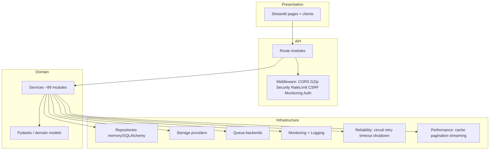
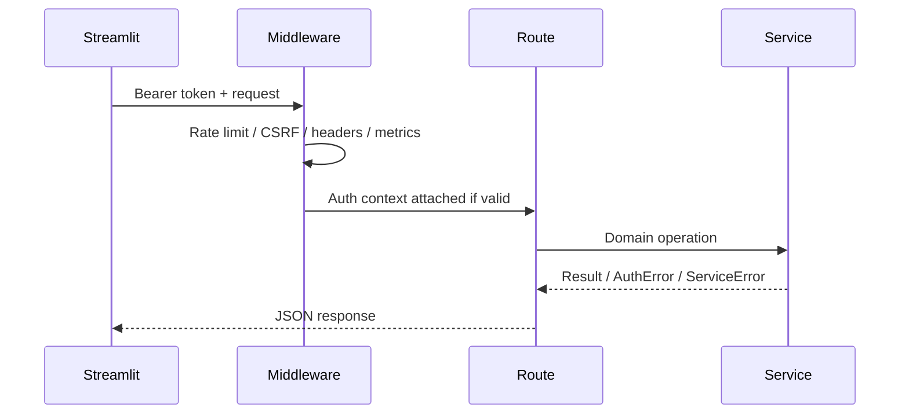
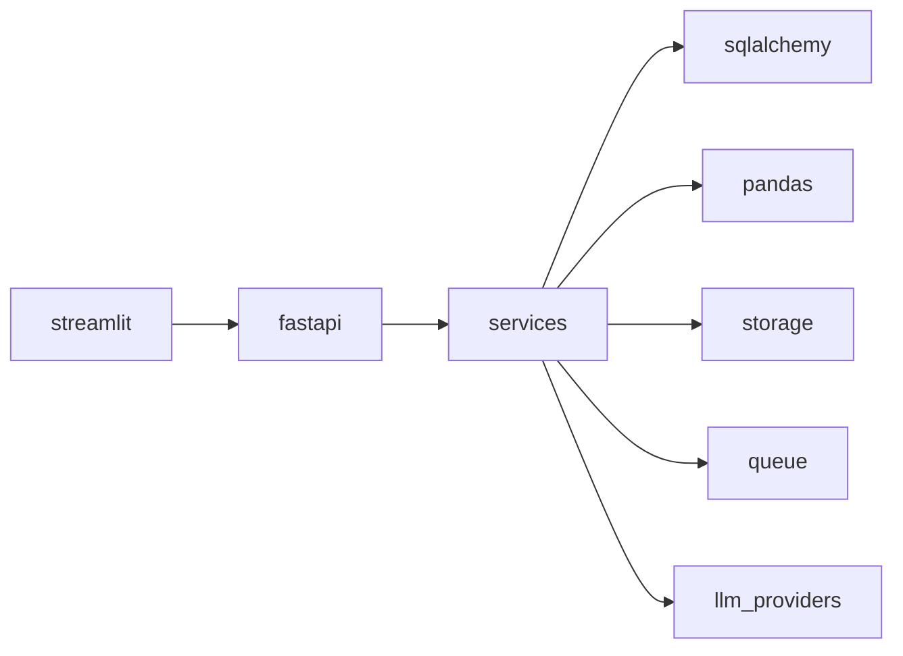

# 02 — Architecture Handbook

## Layer diagram

## Middleware order (`backend/main.py`)

Last added = outermost. Approximate request path:

1. CORSMiddleware (env-driven origins)
2. GZipMiddleware (min 500 bytes)
3. SecurityHeadersMiddleware
4. RateLimitMiddleware
5. CSRFMiddleware (optional via `CSRF_ENABLED`)
6. MonitoringMiddleware
7. AuthContextMiddleware (non-blocking bearer attach)

Lifespan: graceful shutdown via `backend.reliability.shutdown`.

## Frontend architecture

- Entry: `frontend/streamlit_app.py`
- Navigation: `_NAV_GROUPS` sidebar expanders (Home, AI Workspace, Data, Analytics, AI Legacy, Reports, Advanced, Account, Administration, Commercial, Operations)
- Pages: `frontend/app_pages/*_page.py`
- API clients: `frontend/api/*_client.py` + legacy `frontend/api_client/`
- Session: `frontend/utils/session_state.py`, `auth_state.py`

## Backend packages (verified folders)

| Package | Purpose |
|---------|---------|
| `api/` | Routes, middleware, auth deps, error handlers |
| `services/` | Business logic |
| `models/` | Domain schemas |
| `database/` | Engine, session, SQLAlchemy models |
| `repositories/` | Persistence abstraction |
| `storage/` | Object storage abstraction |
| `queue/` + `jobs/` + `workers/` | Async execution |
| `monitoring/` + `logging/` | Observability |
| `security/` | JWT, passwords, hardening |
| `performance/` + `reliability/` | Production readiness |
| `config/` | Typed settings loader |
| `processing/` | Cleaning, profiling, schema |
| `registry/` | Domain/KPI/visualization registries |
| `ai/`, `rag/`, `storyboard/` | Supporting AI/BI packages |

## AI Analyst Runtime (verified services)

Key modules (exist under `backend/services/`):

- `ai_analyst_service.py`, `ai_analyst_runtime_service.py`
- `planning_service.py`, `tool_selection_service.py`, `tool_registry_service.py`
- `agent_service.py`, `memory_service.py`
- `rag_service.py`, `embedding_service.py`, `vector_store_service.py`, `context_retrieval_service.py`
- `workflow_engine_service.py`
- `evaluation_service.py`, `ai_validation_service.py`, `output_validation_service.py`
- `llm_service.py` + `providers/` (openai, anthropic, local)

## Auth / RBAC / Orgs

- Auth: `auth_service.py`, `security/jwt_service.py`, `password_service.py`, routes `/api/v1/auth`
- Orgs/workspaces: `organization_service.py`, `workspace_service.py`
- RBAC: `rbac_service.py` (`evaluate_access`, `has_permission`)

## Jobs / Storage / Monitoring / Commercial

- Jobs: `job_service.py`, queue factory (memory/redis), workers CLI
- Storage: `storage_service.py`, local provider, S3 stub
- Monitoring: health, metrics, tracing, collectors
- Commercial: `billing_service`, `subscription_service`, `usage_service`, `api_key_service`, `admin_service`

## Sequence: authenticated API call

## Dependency diagram (high level)

## Folder diagram

See [03 Folder Documentation](../03_folders/README.md).

## Class diagrams

Practical class diagrams are limited because many stores are dict-backed services rather than rich OOP hierarchies. Repository interfaces live in `backend/repositories/interfaces.py` with memory and SQLAlchemy implementations — see Database Handbook.
