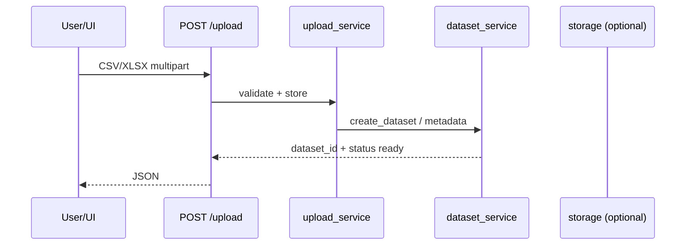
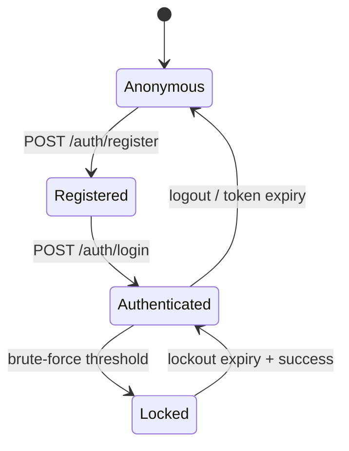

# 04 — Workflow Documentation

## 1) Dataset Upload

- **Inputs:** file bytes, filename, extension in `{.csv,.xlsx,.xlsm}`
- **Outputs:** `dataset_id`, status, row/column counts
- **Errors:** invalid type/size (MAX_UPLOAD_SIZE_MB)
- **Services:** `upload_service`, `dataset_service`, cleaning/profiling downstream

## 2) AI Analysis (AI Analyst)

- **Entry:** `/api/v1` analyst routes + Streamlit AI Analyst page
- **Services:** `ai_analyst_service`, runtime, planning, tools, memory, LLM providers
- **Outputs:** session artifacts, insights, optional evaluation
- **State:** session history page resumes prior sessions

## 3) Workflow Execution

- **Engine:** `workflow_engine_service.execute_workflow`
- **API:** `/api/v1` workflow routes
- **UI:** Workflow Monitor
- **Jobs:** can be submitted async via `job_service`

## 4) Knowledge Retrieval

- **Ingestion:** `knowledge_ingestion_service` + knowledge routes
- **Retrieval:** RAG/context services (`rag_service`, `context_retrieval_service`, embeddings, vector store)
- **Note:** `rag_routes.py` exists; **mount in main.py Not verified**

## 5) Evaluation

- **Service:** `evaluation_service` (session/workflow/agent/tool/RAG/LLM metrics)
- **API:** evaluation routes under `/api/v1`
- **UI:** Evaluation Dashboard

## 6) Authentication

- Brute-force: `backend/security/brute_force.py` integrated in `authenticate_user`
- Tokens: access + refresh (custom JWT)

## 7) Storage

- Upload/list/download/archive/restore/rollback/verify
- Pagination on list; streaming download `?stream=true`
- Versioning + retention helpers in `backend/storage/`

## 8) Background Jobs

- Submit → queue → worker/inline execute → status/progress → retry/cancel
- Types include workflow_execution, analysis, evaluation, knowledge_ingestion, generic (per job routes docs)

## 9) Monitoring

- Liveness `/api/v1/live`, readiness `/api/v1/ready`, health, metrics, system status
- Release: `/api/v1/release/validation`, benchmarks, security audit, performance, recovery

## Retry / circuit / timeout

Implemented as abstractions in `backend/reliability/` (retry, circuit breaker, timeouts, fallback, shutdown). Job retries also exist in job service. Exact production wiring of circuit breakers into every external call: **partially verified** (benchmarks/release use circuits; not every service call).
