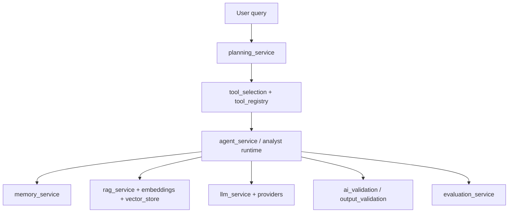

# 08 — AI Handbook

## Beginner view

An **LLM** answers in natural language. Data Bot AI wraps LLMs with **planning**, **tools**, **memory**, **RAG**, and **evaluation** so answers stay closer to business data.

## Advanced view (verified modules)

## Topics

| Topic | Repo evidence | Notes |
|-------|---------------|-------|
| Prompt engineering | `prompt_service`, prompt templates | |
| Planning / reasoning | `planning_service`, executive reasoning | |
| Agents / tools | `agent_service`, tool registry/selection | |
| Memory | `memory_service` | |
| Embeddings / vector search | `embedding_service`, `vector_store_service` | |
| RAG / knowledge | `rag_service`, knowledge ingestion | `/rag` mount Not verified |
| Evaluation / explainability | evaluation + forecast explainability | |
| Hallucination prevention | validation services | Not a guarantee |
| Providers | openai, anthropic, local | Keys via env (**ops**) |
| Governance | security guides, validation, RBAC | No enterprise SSO in 1.0 |

## Safety

- Validate outputs before executive presentation
- Prefer retrieval-grounded answers when knowledge is ingested
- Keep secrets out of prompts/logs
