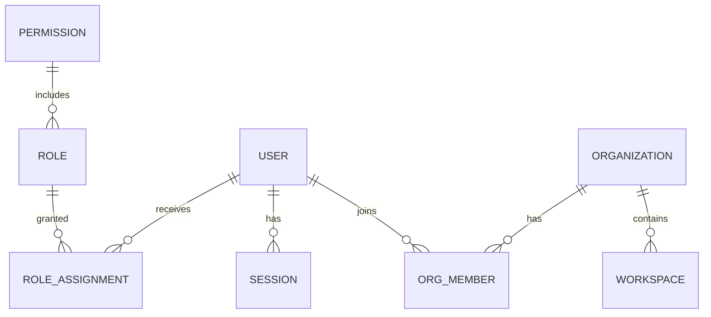

# 10 — Database Handbook

## Persistence strategy

| Concern | Implementation | Notes |
|---------|----------------|-------|
| Engine/session | `backend/database/session.py` | Pool tuning; SQLite StaticPool for memory |
| Config | `backend/database/config.py` | DATABASE_URL |
| ORM models | `backend/database/models/` | auth, org, rbac, audit, knowledge, runtime |
| Repositories | memory + SQLAlchemy | `repositories/registry.py` switches |
| Migrations | Alembic (`alembic/`) | `e5e80b7071e5_initial_schema.py` present |
| Transactions | `database/transaction.py` | repository_context for multi-repo writes |

## ER (logical)

Exact columns: see SQLAlchemy models under `backend/database/models/`.

## Object storage lifecycle (not SQL)

Upload → version → metadata → download/stream → archive/restore → rollback → retention/checksum verify.

## Migration strategy

1. Backup data
2. `alembic upgrade head`
3. Validate `/api/v1/release/validation`

Commercial billing/API-key stores remain **in-memory** in v1.0 (KNOWN_ISSUES).
