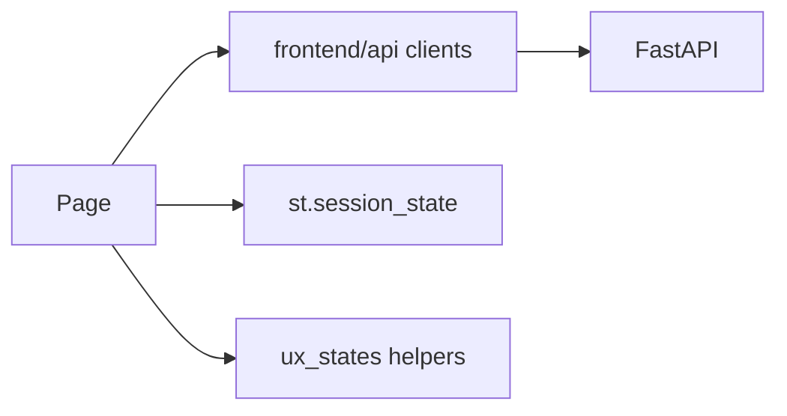

# 11 — Frontend Handbook

## Entry & navigation

`frontend/streamlit_app.py` defines `_NAV_GROUPS` (Power BI–style order, Sprint 8.8):

1. **Start** — Home
2. **Get data** — Upload, Dataset Manager, Dataset Preview, Data Cleaning
3. **Analyze** — Dashboard, Charts, Business Analysis, Pivot Tables, Dashboard Studio, Location Insights
4. **AI insights** — AI Analyst, AI Chat, AI Insights, Knowledge Center, Evaluation Dashboard, Session History
5. **Automate** — Workflow Monitor, Job Monitor
6. **Storage** — Storage Manager, Dataset Versions, Artifact Browser, Storage Statistics
7. **Share** — Reports, Storyboard
8. **Advanced** — SQL Lab, DAX Studio, Settings
9. **Account** — Login, Register, Profile, Change Password
10. **Admin** — Orgs / RBAC / Commercial / Ops (orgs, workspaces, members, invitations, roles, permissions, billing, usage, subscriptions, API keys, health, metrics, status, dependencies, config)

Sidebar: Backend API URL lives under a collapsed **Connection** expander.

Shared UX helpers: `frontend/components/ux_states.py` (empty/loading/error/badge/stepper).  
Design system (Sprint 8.9): `frontend/design_system/` — tokens, buttons, cards, charts, layout. Docs: [`docs/design_system/`](../../docs/design_system/README.md).  
See also [`docs/ux/SPRINT_8_8_UX_REPORT.md`](../../docs/ux/SPRINT_8_8_UX_REPORT.md).

## Page modules (`frontend/app_pages/`)

Each `*_page.py` typically: check auth → call API client → render Streamlit widgets.

| Page module | Purpose |
|-------------|---------|
| home_page | Landing / guided workflow stepper |
| auth_pages | Login/register/profile |
| ai_analyst_workspace_page | NL analysis (structured answer tabs) |
| dataset_manager_page / dataset_page | Datasets |
| workflow_monitor_page | Workflows + stage timeline |
| knowledge_center_page | Knowledge |
| evaluation_dashboard_page | Evaluation scorecards |
| job_monitor_page | Jobs + status badges |
| storage_* / artifact_browser / dataset_versions | Storage lifecycle |
| dashboard_* / reports / storyboard / sql_dax / location | Analytics & reports |
| rbac_pages | Admin RBAC UI |
| billing_* / usage / subscription / apikey / admin / system_analytics | Commercial |
| system_health / metrics / application_status / dependency / configuration_viewer | Ops |

## Session state

`frontend/utils/session_state.py`, `auth_state.py` — tokens, selected dataset, nav page.

## Architecture

## Expected screenshots

See [12 Pictorial Evidence](../12_pictorial_evidence/README.md) and Sprint 8.8 UX report placeholders.
