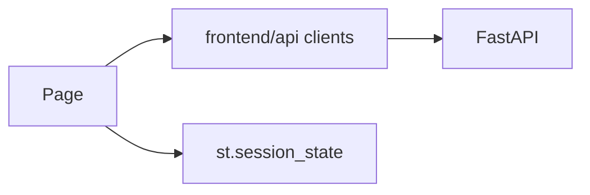

# 11 — Frontend Handbook

## Entry & navigation

`frontend/streamlit_app.py` defines `_NAV_GROUPS`:

1. Home
2. AI Workspace (Analyst, Dataset Manager, Workflow, Knowledge, Evaluation, Sessions, Jobs, Storage…)
3. Data (Upload, Cleaning, Preview)
4. Analytics (Dashboard, Charts, Business Analysis, Pivot, Studio)
5. AI Legacy (Chat, Insights)
6. Reports (Reports, Storyboard, Location)
7. Advanced (SQL Lab, DAX, Settings)
8. Account (Login, Register, Profile, Password)
9. Administration (Orgs, Workspaces, Members, Invitations, Roles, Permissions)
10. Commercial (Billing, Usage, Subscriptions, API Keys, Admin…)
11. Operations (Health, Metrics, Status, Dependencies, Config)

## Page modules (`frontend/app_pages/`)

Each `*_page.py` typically: check auth → call API client → render Streamlit widgets.

| Page module | Purpose |
|-------------|---------|
| home_page | Landing / overview |
| auth_pages | Login/register/profile |
| ai_analyst_workspace_page | NL analysis |
| dataset_manager_page / dataset_page | Datasets |
| workflow_monitor_page | Workflows |
| knowledge_center_page | Knowledge |
| evaluation_dashboard_page | Evaluation |
| job_monitor_page | Jobs |
| storage_* / artifact_browser / dataset_versions | Storage lifecycle |
| dashboard_* / reports / storyboard / sql_dax / location | Analytics & reports |
| rbac_pages | Admin RBAC UI |
| billing_* / usage / subscription / apikey / admin / system_analytics | Commercial |
| system_health / metrics / application_status / dependency / configuration_viewer | Ops |

## Session state

`frontend/utils/session_state.py`, `auth_state.py` — tokens, selected dataset, nav page.

## Architecture

## Expected screenshots

See [12 Pictorial Evidence](../12_pictorial_evidence/README.md).
