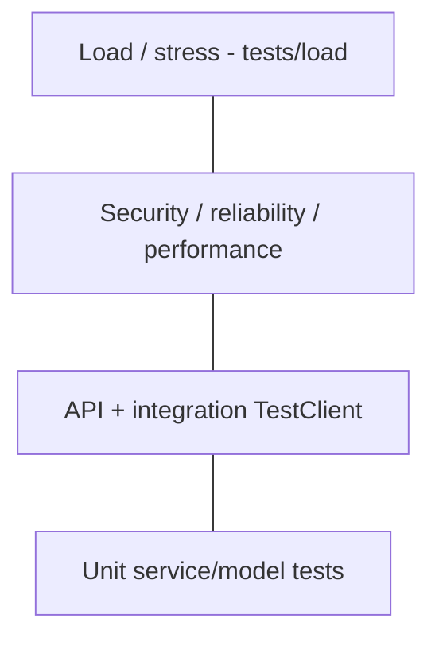

# 13 — Testing Handbook

## Statistics (verified at generation time)

| Metric | Value |
|--------|-------|
| `test_*.py` files under `tests/` | **125** |
| Full suite at v1.0.0 release gate | **634 passed** |
| Categories | unit, API, auth, orgs, rbac, jobs, storage, infra, billing, admin, apikeys, load, security, performance, reliability, release, database, repositories |

## Testing pyramid (as practiced)

## What each area validates

| Folder | Validates |
|--------|-----------|
| `tests/auth` | JWT, passwords, auth API |
| `tests/organizations`, `tests/rbac` | Tenancy + permissions |
| `tests/jobs` | Job lifecycle, queue, workers |
| `tests/storage` | Providers, versioning, API |
| `tests/infrastructure` | Config, logging, metrics, health |
| `tests/billing`, `apikeys`, `admin` | Commercial platform |
| `tests/load` | Concurrent users/jobs/API smoke |
| `tests/security` | Headers, sanitization, lockout |
| `tests/reliability` | Circuit, retry, timeout, shutdown |
| `tests/release` | Benchmarks, validation, E2E sample dataset |
| Root `tests/test_*.py` | AI, RAG, forecast, workflow, analytics contracts |

## Why testing matters

Prevents regressions across a large service surface (~89 services) and supports the v1.0 production claim with measurable evidence.
