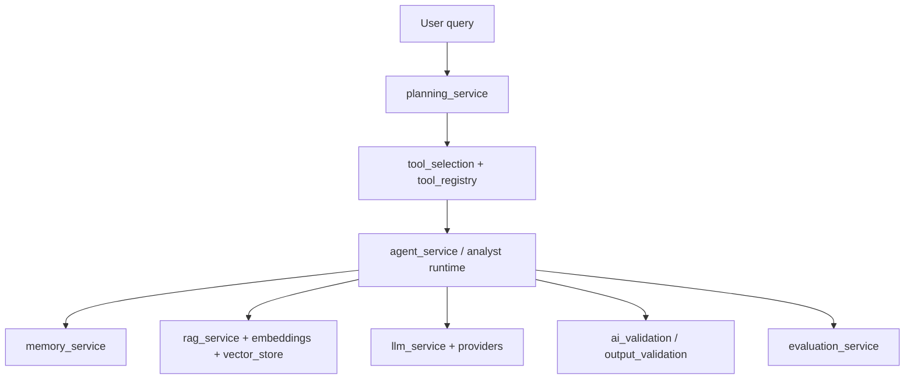

# AI Workflow

## Principles

- Plan before tool use
- Prefer retrieval-grounded answers when knowledge is ingested
- Validate outputs before executive presentation
- Keep secrets out of prompts/logs
- Hallucination prevention is layered validation — **not a guarantee**

## Notes

- `/api/v1` analyst gateway is a primary production surface
- `/rag` route module exists; mount status in `main.py` labeled **Not verified** in handbook

Deep reference: [`documentation/08_ai/README.md`](../../documentation/08_ai/README.md)
