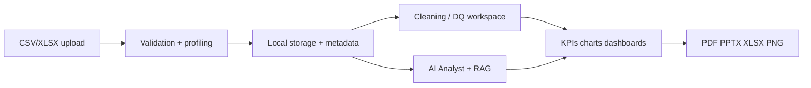

# Data Flow

## Verified stages

1. Upload via FastAPI (`POST /upload` and related dataset routes)
2. Persist under `data/uploads`, `data/processed`, `data/metadata` (local-first)
3. Profile / detect domain roles via domain intelligence + registries
4. Analytics services produce KPIs, charts, insights
5. Frontend Streamlit pages consume API clients and/or local session dataframes for selected UX paths

Deep reference: [`documentation/04_workflows/README.md`](../../documentation/04_workflows/README.md)
