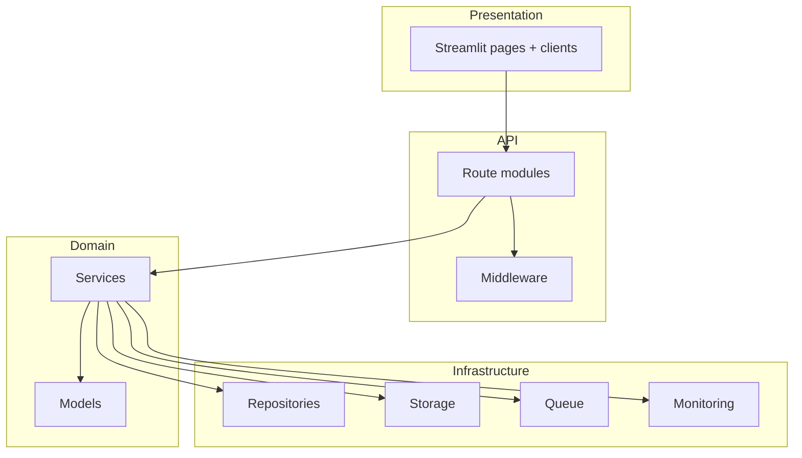

# Layer Architecture

## Layer rules

1. **Presentation** talks to the API via HTTP clients; no direct DB/storage access for server-backed features.
2. **Routes** are thin: validate input, call services, return responses.
3. **Services** own business logic and orchestrate repos/storage/AI.
4. **Repositories / storage / queue** are infrastructure behind interfaces when possible.
5. **Registries/plugins** resolve domain behavior (`DomainContext` canonical).

Deep reference: [`documentation/02_architecture/README.md`](../../documentation/02_architecture/README.md), [`docs/architecture/README.md`](../../docs/architecture/README.md)
