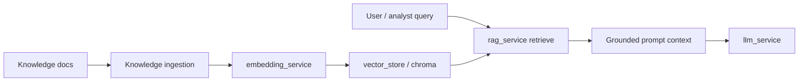

# RAG Flow

## Storage paths (settings)

- `data/rag_indexes`
- `data/vector_store/chroma`

## Notes

- RAG-related services and `rag_routes.py` exist
- Handbook marks `/rag` mount in `create_app()` as **Not verified** for v1.0.0 — confirm before documenting as live API

Deep reference: ADR-007, [`documentation/08_ai/README.md`](../../documentation/08_ai/README.md)
